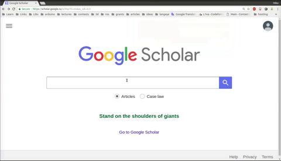

credo
===============
Chrome extension to download Citation and article pdf from SciHub in one click from google scholar 

TODO: 
Add options to change endNote on other citation formats

Result:
-----

Install:
-----
Steps:
* Download zip
* Extract from zip
* Open chrome extensions
* Set 'developer mode'
* 'Load unpacked' directory with extension

